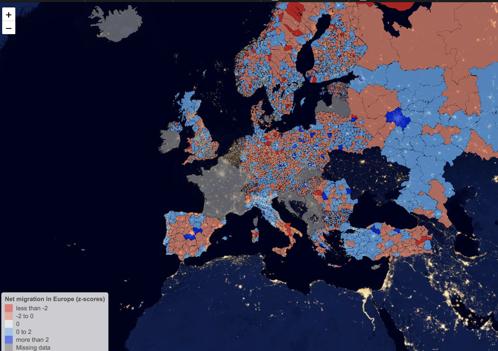

# Net Internal Migration Gains and Losses across Europe

[Francisco Rowe](http://www.franciscorowe.com) [[`@fcorowe`](http://twitter.com/fcorowe)]<sup>1*</sup>

<sup>1</sup> *Geographic Data Science Lab, University of Liverpool, Liverpool, United Kingdom*

This site displays a map documenting the patterns of net internal migration gains and losses across Europe. Net migration gains are in blue. Net losses are represented in red. Expand and interact with the map by clicking on the image. 

The patterns shown in the map are discussed and documented in [Rowe et al. (2019)]( https://doi.org/10.12765/CPoS-2019-18). If you would like to replicate this map, find the relevant code and data on this [Github repository]()


[](map.html)

## Code

If you would like to replicate this map, here is the code:

[Code](./code/eu_netmigration_map.Rmd)


## Citation

If you use the interative map and/or code, you can give appropriate attribution by using the following citation:

```
@article{rowe2019impact,
  title={Impact of Internal Migration on Population Redistribution in Europe: Urbanisation, Counterurbanisation or Spatial Equilibrium?},
  author={Rowe, Francisco and Bell, Martin and Bernard, Aude and Charles-Edwards, Elin and Ueffing, Philipp},
  journal={Comparative Population Studies},
  volume={44},
  year={2019}
}
```
